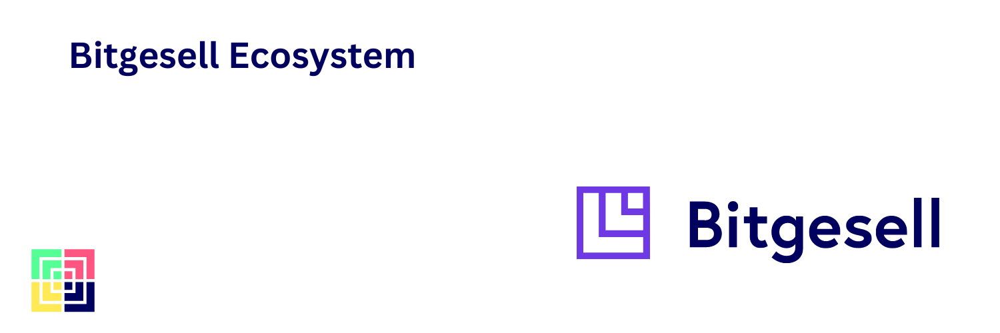

# Bitgesell Ecosystem Map
A list of active Bitgesell Projects

## Wallets
- [Official Wallet Software](https://bglwallet.io)

## Exchanges
- Pancakeswap(V2): https://pancakeswap.finance/swap?outputCurrency=0x2bA64EFB7A4Ec8983E22A49c81fa216AC33f383A
- UniSwap (V3): https://app.uniswap.org/#/swap?outputCurrency=0x2bA64EFB7A4Ec8983E22A49c81fa216AC33f383A (or select a token 0x2bA64EFB7A4Ec8983E22A49c81fa216AC33f383A)

## Block Explorers
- https://bgl.bitaps.com/
- https://explorer.bglnode.online/
- https://bitgesellexplorer.com
- http://bitgesellexplorer.ca

## Mining Pools
- https://www.mining-dutch.nl/
- http://zergpool.com/
- https://pool.bitaps.com
- https://zpool.ca/

## Development Tools
These are links to all resources regarding the official Bitgesell core software:

- [Official Github Repository](https://github.com/BitgesellOfficial/bitgesell) - Official Software that powers the Bitgesell Store of Value.
- [Bitgesell Releases](https://github.com/BitgesellOfficial/bitgesell/releases/) - Official Releases of Bitgesell core software for various platforms - Windows, Linux, MacOs
- [Official Website](https://bitgesell.ca/) - Bitgesell oficial website
- [Official Bitgesell Mainnet Wallet](https://app.bglwallet.io/) - Bitgesell Mainnet Wallt
- [Official Bitgesell Web Wallet Repository](https://github.com/BitgesellOfficial/bitgesell-wallet)
- [Official WBGl Bridge](https://bitgesell.ca/) - WBGL/BGL Bridge
- [Bitgesell DAO notifications](https://app.push.org/#/channels) - DAO notifications channel
- [Main Bitgesell DAO](https://dao.bglnode.online/) - Bitgesell DAO based on Snapshot
- [Mainnet MetaMask Wallet](https://snap.bglnode.online/) - Mainnet wallet using MetaMask Flask
- [Mnemonic to WIF converter](https://app.bglnode.online/mnemonic.html) - Mnemonic to WIF converter
- [Bitgesell Testnet Wallet](https://wallet.bglnode.online/) - Testnet wallet
- [Official Bitgesell Mainnet Block Explorer](https://explorer.bglnode.online/) - Real-time explorer (mainnet/testnet)
- [Official Bitgesell Tesnet Block Explorer](https://testnet.bglnode.online/) - Testnet explorer
- [Official Bitgesell Real-time  Mempool](http://mempool.bglnode.online/) - Real-time mempool
- [Bitgesell Testnet & RPC Endpoint](https://api.bglnode.online/) - API testnet and RPC endpoint
- [Bitgesell Mainnet RPC & Faucet](https://bglnode.online/) - Node RPC endpoint mainnet and faucet testnet
- [Official Docker Image](https://github.com/BitgesellOfficial/bgld-docker.git) - Official Docker image for efficient deployments

## 2. Bitgesell Libraries

The following are some official Bitgesell libraries for various popular programming languages:

### 1. TypeScript/JavaScript

- [jsbgl](https://github.com/BitgesellOfficial/jsbgl) - A JavaScript library for Bitgesell

### 2. Python

- [pybl](https://github.com/BitgesellOfficial/pybgl) Python bitgesell library based on pybtc library. Current version is 3.0
- [BGLAPI Server](https://github.com/BitgesellOfficial/bglapiserver) - BGLAPI Server is based on[BTCAPI Server](https://github.com/bitaps-com/btcapiserver)

### 3. Rust

- [Brotlic](https://github.com/BitgesellOfficial/brotlic)- Brotlic provides Rust bindings to all compression and decompression APIs. On the fly compression and decompression is supported for both BufRead and Write via CompressorReader<R>

### 4. Golang

- [bgld](https://github.com/BitgesellOfficial/bgld) - A fork of btcd (excellent project) to support Bitgesell coin. This currently can be used as a library of useful functions and it not tested for production use.

- [multichain](An abstraction over multiple different underlying blockchains (Bitcoin, Ethereum, Zcash, etc.) )

## Communities
- [Official Discord](link)
- [Telegram](link)

## Services
[Bridge for transferring BGL <-> WBGL on Eth/BSC](https://bglswap.com)

## Projects
- [Github](https://github.com/BitgesellOfficial)

## Education & Information
- [Official Website](https://Bitgesell.ca)
- [Community Docs](https://bitgesell-docs.netlify.app/)
- [CoinMarketCap](https://coinmarketcap.com/currencies/bitgesell/)
- [Crypto.com](https://crypto.com/price/bitgesell)

## Media & Publications
- [Bitcoin Talk](https://bitcointalk.org/index.php?topic=5238559)
- kriptosozluktv.com (Turkish)
- U.Today
- Bitcoin.com
- BGL and Crypto.com integration (Apr 20, 2022)
- coingape.com (Jul 07, 2022)
- bitcoinist.com (Mar 29, 2021)
- U.Today (Feb 24, 2021)
- newsbtc.com
- Cointelegraph
- bitcoininsider.org
- coinspeaker.com
- themerkle.com
- thebitcoinnews.com
- coin-turk.com (Turkish)
- blocknewsafrica.com
- cryptobenelux.com (NL)

### YouTube:
- Explainer video from Professor Crypto - https://www.youtube.com/watch?v=RTIR89HMH_U
- Professor Crypto - https://www.youtube.com/watch?v=8ZI0CvhgOyc
- Bitcoin for Beginners - https://youtu.be/QkUGIxjdjaA
- The right traders - https://www.youtube.com/watch?v=ZzjhstNSi50
- https://www.youtube.com/watch?v=FzsRCH8JDEM

